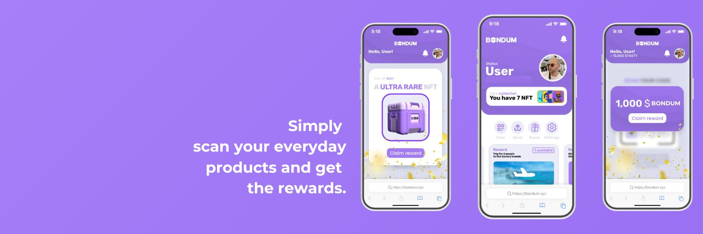

# Bondum Mobile

> [bondum.xyz](https://bondum.xyz)



A mobile-first loyalty rewards platform on Solana. Scan products, earn **$BONDUM** tokens and brand-specific loyalty tokens, swap them via Jupiter, and redeem exclusive rewards and NFTs -- all from your phone.

## How It Works

1. **Scan** a product QR code at a partner brand (e.g. PaniCafe)
2. **Earn** $BONDUM tokens and brand-specific loyalty tokens (e.g. $PANICAFE)
3. **Swap** tokens via Jupiter aggregator (BONDUM <-> USDC, SOL, PANICAFE)
4. **Redeem** rewards: discounts, bonus tokens, or exclusive NFTs
5. **Send** tokens to any Solana wallet directly from the app

## Features

- **Dual Authentication** -- Solana Mobile Wallet Adapter (Phantom, Solflare) or Privy email-based embedded wallet
- **QR Code Scanner** -- Scan product codes to claim on-chain rewards with anti-replay verification
- **Seed Vault Support** -- Automatic detection and integration on Solana Mobile Seeker devices
- **Referral System** -- Invite friends and earn bonus $BONDUM tokens on-chain
- **Token Swap** -- Jupiter aggregator integration with real-time quotes and slippage control
- **Token Transfers** -- Send SOL or any SPL token to any address
- **NFT Collection** -- View owned NFTs with images via DAS API + on-chain Metaplex fallback
- **Pull-to-Refresh** -- Live balance updates across all screens
- **Reward Marketplace** -- Browse affiliated brands and redeem rewards with $BONDUM

## Architecture

```
Mobile App (Expo / React Native)
  |
  |-- Auth -------> MWA / Seed Vault (native Solana wallet)
  |                 Privy (email -> embedded wallet)
  |
  |-- Rewards ----> Reward API (claim validation, anti-replay)
  |                 SPL token transfer from treasury on verified scan
  |                 Nonce-based QR codes with expiry
  |
  |-- Balances ---> Solana RPC (getTokenAccountsByOwner)
  |                 Token Program + Token-2022 fallback
  |
  |-- NFTs -------> DAS API (getAssetsByOwner)
  |                 On-chain Metaplex metadata fallback
  |
  |-- Swaps ------> Jupiter Aggregator API (quote + swap)
  |
  |-- Transfers --> Raw SPL Token instructions (SystemProgram / ATA)
  |
  |-- Persistence -> expo-secure-store (auth state, claim history)

Reward Server (Node.js)
  |
  |-- /claim -----> Validate QR nonce + signature
  |                 Transfer SPL tokens from treasury wallet
  |                 Return tx signature to app
  |
  |-- /redeem ----> Verify $BONDUM balance
  |                 Execute reward redemption
  |
  |-- /referral --> Track referral codes
  |                 Distribute bonus tokens to both parties
```

## Tech Stack

- [Expo](https://expo.dev) + [Expo Router](https://docs.expo.dev/router/introduction/) -- React Native framework with file-based routing
- [Uniwind](https://uniwind.dev/) -- Tailwind CSS for React Native
- [@solana/kit](https://github.com/solana-labs/solana-web3.js) -- Solana blockchain interaction
- [@wallet-ui/react-native-kit](https://github.com/wallet-ui/wallet-ui) -- Solana Mobile Wallet Adapter
- [@privy-io/expo](https://docs.privy.io/) -- Web3 email authentication with embedded wallets
- [Jupiter Aggregator](https://dev.jup.ag/) -- Token swap quotes and transactions
- [DAS API](https://docs.helius.dev/solana-apis/digital-asset-standard-das-api) -- NFT metadata and images
- [@tanstack/react-query](https://tanstack.com/query) -- Data fetching, caching, and auto-refetch
- [expo-camera](https://docs.expo.dev/versions/latest/sdk/camera/) -- QR code scanning
- [expo-secure-store](https://docs.expo.dev/versions/latest/sdk/securestore/) -- Encrypted local persistence

## Project Structure

```
src/
|-- app/                    # Expo Router routes
|   |-- _layout.tsx        # Root layout with providers
|   |-- (auth)/            # Authentication screens
|   |   |-- _layout.tsx
|   |   |-- welcome.tsx    # Welcome/login screen
|   |-- (tabs)/            # Main app tabs
|   |   |-- _layout.tsx    # Tab bar configuration
|   |   |-- (home)/        # Home dashboard + send + settings
|   |   |-- (trade)/       # Token swap (Jupiter)
|   |   |-- (rewards)/     # Rewards list and detail
|   |   |-- (assets)/      # Token balances + NFT gallery
|   |   |-- (profile)/     # User profile + wallet address + referral
|   |-- scan/              # QR code scanner
|-- components/            # Reusable UI components
|   |-- ui/               # Base components (Button, Card, Avatar, etc.)
|   |-- TransactionConfirmation  # Tx result with Solscan link
|-- contexts/             # React contexts
|   |-- AuthContext.tsx   # Authentication state (MWA + Privy + Guest)
|-- hooks/                # Custom React hooks
|   |-- useBondumBalance  # $BONDUM token balance
|   |-- useTokenBalances  # SOL, USDC, PANICAFE balances
|   |-- useWalletNfts     # NFT collection via DAS API
|   |-- useSwapQuote      # Jupiter swap quotes with debounce
|   |-- useRewards        # Reward catalog from API
|   |-- useSeekerDevice   # Seeker / Seed Vault detection
|-- services/             # API clients and utilities
|   |-- solana.ts         # RPC calls, DAS, transfers
|   |-- jupiter.ts        # Jupiter aggregator API
|   |-- rewardApi.ts      # Reward distribution API client
|   |-- qrParser.ts       # QR code parser with nonce/expiry validation
|   |-- storage/          # SecureStore persistence
|-- types/                # TypeScript types
|-- constants/            # Design tokens (colors, spacing, typography)
|-- global.css            # Global Tailwind styles
```

```
server/                   # Reward distribution API
|-- index.ts              # HTTP server with claim/redeem/referral endpoints
|-- package.json          # Server dependencies
```

## Getting Started

### Prerequisites

- Node.js 18+
- npm or pnpm
- Expo CLI (`npm install -g expo-cli`)
- Android Studio (for Android) or Xcode (for iOS)

### Installation

```bash
npm install
```

### Environment Variables

Create a `.env` file:

```bash
EXPO_PUBLIC_PRIVY_APP_ID=your-privy-app-id
EXPO_PUBLIC_SOLANA_RPC_URL=your-rpc-url   # optional, defaults to mainnet
```

### Running the App

```bash
# Expo Go (limited -- no camera or wallet adapter)
npm start

# Development build (required for full functionality)
npm run android
npm run ios
```

## License

Private -- All rights reserved

## Links

- Website: [bondum.xyz](https://bondum.xyz)
